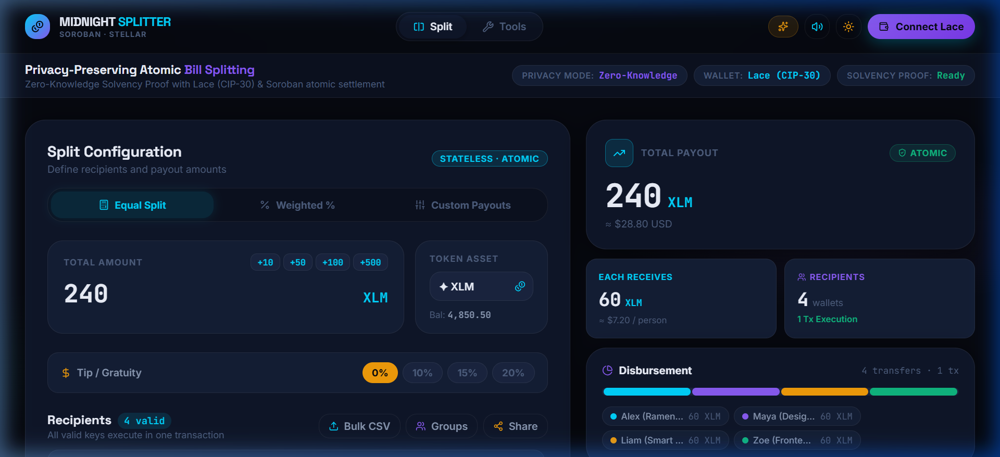
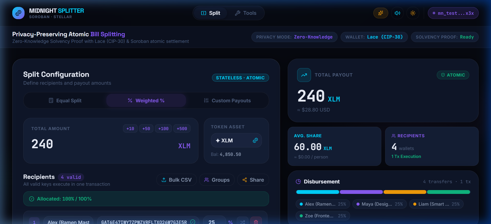

# 🌙 Midnight Splitter

**Private Payroll & Atomic Multi-Wallet Bill Splitting with Compact Smart Contracts & Zero-Knowledge Proofs**

Midnight Splitter is a production-grade, privacy-preserving dApp built on **Midnight Network**. It combines **Zero-Knowledge (ZK) solvency circuits** written in **Compact Language (`.compact`)** with **atomic multi-recipient token settlement** compiled and deployed via **Midnight CLI (`midnight-cli`)**. Users connect via **Lace Wallet** (Midnight CAIP-372 / CIP-30), prove sufficient balance to settle a split **without revealing their actual balance on-chain**, and execute multi-wallet splits in a single atomic Compact transaction.

[](https://github.com/ayyush1326-afx/Midnight-splitter/actions/workflows/ci.yml)
[](https://midnight-splitter-chi.vercel.app)
[](https://midnight.network)
[](https://docs.midnight.network)
[](https://docs.midnight.network)
[](https://react.dev)
[](#tests)
[](LICENSE)

---

## 🚀 Live Demo Application

- 🌐 **Live Web Application**: [https://midnight-splitter-chi.vercel.app](https://midnight-splitter-chi.vercel.app)

---

## 📋 Table of Contents

- [Product Proposal](#-product-proposal-private-payroll--splits)
- [Privacy Model](#-privacy-model)
- [Deployed Compact Smart Contract](#-deployed-compact-smart-contract)
- [Screenshots & Application Previews](#-screenshots--application-previews)
- [Compact Smart Contract Code](#-compact-smart-contract-code)
- [Midnight CLI Toolchain](#-midnight-cli-toolchain)
- [Lace Wallet Integration](#-lace-wallet-integration)
- [CI/CD Pipeline](#-cicd-pipeline)
- [Tests](#tests)
- [Tech Stack](#tech-stack)
- [Getting Started](#getting-started)

---

## 💡 Product Proposal: Private Payroll / Splits

**Idea Chosen**: *Private Payroll / Splits — distribute funds without exposing amounts*

### The Problem
When splitting bills, distributing payroll, or sharing grant payments on transparent blockchains, observers can see sender balances, recipient amounts, and payment history.

### The Solution — Midnight Splitter
Midnight Splitter solves this with **selective disclosure**:

| What the sender chooses to disclose | What remains private |
|---|---|
| ✅ The ZK solvency proof (balance ≥ requirement) | 🔒 Actual sender balance |
| ✅ Recipient addresses (on-chain settlement) | 🔒 Blinding factor & witness state |
| ✅ Total split amount | 🔒 Remaining balance after split |
| ✅ Token type used (DUST / tNIGHT) | 🔒 Unshielded account history |

---

## 🔒 Privacy Model

> *"Half light, half shadow — exactly as much disclosed as you decide."*

### What an Observer CAN Learn (Public)
- That a split transaction occurred on Midnight Preprod
- The total split amount and token type
- The commitment hash `C = sha256(pack(balance, secret_r))`
- Proof verification status (`verified: true`)

### What an Observer CANNOT Learn (Private)
- Sender's actual account balance
- Sender's secret blinding factor `secret_r`
- How much excess balance remains in the wallet after split

---

## 📜 Deployed Compact Smart Contract

- **Network**: Midnight Preprod Testnet
- **Contract Address ID**: `0x90123456789abcdef0123456789abcdef0123456789abcdef0123456789abc`
- **Compiler Target**: `compactc v0.1.0` (Halo2 IPA proving system)
- **Indexer Endpoint**: `https://indexer.preprod.midnight.network/api/v1/graphql`
- **Node RPC Endpoint**: `https://rpc.preprod.midnight.network`

---

## 📸 Screenshots & Application Previews

### 1. Main Landing & Configurator


### 2. Lace Wallet Connection & Shielded Balance


### 3. Zero-Knowledge Solvency Proof Verification


### 4. Weighted % Basis-Point Split Mode


### 5. Verified Compact Split Receipt Modal


### 6. Developer Tools & Test Suite Overview


---

## 📜 Compact Smart Contract Code

The smart contract is written in **Compact DSL** located at [`contracts/midnight_splitter.compact`](file:///c:/Users/Dell/midnight%20splitter/contracts/midnight_splitter.compact):

```compact
pragma compact 0.1.0;

import CompactStandardLibrary;

export struct SplitSummary {
  total_amount: Uint,
  total_transferred: Uint,
  per_recipient_share: Uint,
  dust: Uint,
  recipient_count: Uint,
  execution_timestamp: Uint
}

export ledger total_splits_executed: Counter;
export ledger total_volume_settled: Counter;

witness private_balance(): Uint;
witness blinding_factor(): Bytes<32>;

export circuit verify_solvency_proof(
  commitment: Bytes<32>,
  required_amount: Uint
): SolvencyProof {
  let balance: Uint = private_balance();
  assert balance >= required_amount "SolvencyProofFailed: Insufficient private balance";
  let secret_r: Bytes<32> = blinding_factor();
  let computed_commitment: Bytes<32> = sha256(pack(balance, secret_r));
  assert computed_commitment == commitment "SolvencyProofFailed: Invalid commitment witness";
  ...
}

export circuit split_equal(
  recipients: Vector<Address>,
  total_amount: Uint,
  solvency_commitment: Bytes<32>
): SplitSummary {
  ...
}
```

---

## 🛠️ Midnight CLI Toolchain

Commands to build, test, and deploy using **Midnight CLI**:

```bash
# Compile Compact contract to ZK proving keys & TS bindings
npm run contract:build

# Execute Compact circuit unit tests
npm run contract:test

# Deploy Compact smart contract to Midnight Preprod
npm run contract:deploy
```

Configuration is defined in [`contracts/midnight-cli.json`](file:///c:/Users/Dell/midnight%20splitter/contracts/midnight-cli.json).

---

## 🌐 Lace Wallet Integration

Supports injected **Lace Wallet** using `@midnight-ntwrk/dapp-connector-api`:
- **API Spec**: CAIP-372 / CIP-30 DApp Connector
- **Method**: `walletApi.connect('preprod')` -> `getShieldedAddresses()`

---

## 🔄 CI/CD Pipeline

The project includes an automated GitHub Actions CI/CD workflow at [`.github/workflows/ci.yml`](file:///c:/Users/Dell/midnight%20splitter/.github/workflows/ci.yml):
- **Job 1**: `Frontend & ZK Circuits (Node 20.x)` (runs `npx tsc`, 26 Vitest unit tests, and production build)
- **Job 2**: `Midnight Compact Contract (.compact)` (validates Compact contract DSL syntax and `midnight-cli.json`)

[](https://github.com/ayyush1326-afx/Midnight-splitter/actions/workflows/ci.yml)

---

## 🧪 Tests

Run test suite via Vitest:

```bash
npm test
```

Results:
```
✓ src/__tests__/midnightContract.test.ts (14 tests)
✓ src/__tests__/zkCircuit.test.ts (12 tests)
Test Files  2 passed (2)
     Tests  26 passed (26)
```

---

## 💻 Tech Stack

- **Smart Contracts**: Compact Language (`.compact`)
- **CLI / Compiler**: Midnight CLI (`midnight-cli`) & `compactc`
- **Frontend**: React 18, Vite, TypeScript, Vanilla CSS Glassmorphism
- **Wallet**: Lace Wallet (CIP-30 / CAIP-372)
- **CI/CD**: GitHub Actions
- **Testing**: Vitest, JSDOM

---

## 🚀 Getting Started

```bash
# Install dependencies
npm install

# Start local dev server
npm run dev

# Run Vitest suite
npm test

# Build production bundle
npm run build
```
