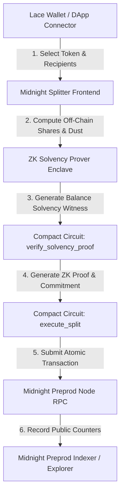

# 🌙 Midnight Splitter

> **Private Payroll & Atomic Multi-Wallet Bill Splitting on Midnight Network**  
> Preserving financial privacy using **Zero-Knowledge (ZK) Enclave Solvency Proofs** written in **Compact DSL (`.compact`)** and executed atomically via **Lace Wallet** & **Midnight Preprod**.

[](https://github.com/ayyush1326-afx/Midnight-splitter/actions/workflows/ci.yml)
[](https://midnight-splitter-chi.vercel.app)
[](https://midnight.network)
[](https://docs.midnight.network)
[](https://docs.midnight.network)
[](https://react.dev)
[](#-tests)
[](LICENSE)

---

## 🌐 Live Application & Demo

* 🚀 **Web Application**: [https://midnight-splitter-chi.vercel.app](https://midnight-splitter-chi.vercel.app)
* 📜 **Midnight Preprod Explorer**: [https://explorer.preprod.midnight.network](https://explorer.preprod.midnight.network)
* 🚰 **Official Testnet Faucet**: [https://midnight-tmnight-preprod.nethermind.dev](https://midnight-tmnight-preprod.nethermind.dev)

---

## 📋 Table of Contents

- [Overview & Problem Statement](#-overview--problem-statement)
- [Privacy Model](#-privacy-model)
- [System Architecture](#-system-architecture)
- [Smart Contract Specification](#-smart-contract-specification)
- [Project Structure](#-project-structure)
- [Midnight Toolchain & Deployment](#-midnight-toolchain--deployment)
- [Lace Wallet Integration](#-lace-wallet-integration)
- [Application Screenshots](#-application-screenshots)
- [Tests & Verification](#-tests--verification)
- [Getting Started](#-getting-started)

---

## 💡 Overview & Problem Statement

### The Problem
When distributing payroll, splitting group bills, or dispersing grant payouts on traditional public blockchains, every participant's account balance, transaction history, and exact asset positions are publicly exposed on-chain.

### The Solution — Midnight Splitter
Midnight Splitter enables **selective disclosure**: senders prove they hold sufficient shielded funds to cover a multi-wallet split **without revealing their actual balance, blinding factors, or remaining wallet balance to the public ledger**.

| Dimension | Public Blockchains (Ethereum, Cardano) | Midnight Splitter (Compact DSL) |
|---|---|---|
| **Sender Balance** | 🔓 Fully visible on block explorer | 🔒 Private inside ZK Enclave witness |
| **Solvency Verification** | Requires revealing account balance | ✅ Proved via Zero-Knowledge proof ($B \ge \sum A_i$) |
| **Multi-Transfer Execution** | Sequential transactions (risk of partial failure) | ✅ Atomic Compact transaction (all-or-nothing) |
| **Dust Retention** | Fractional dust burned or lost | ✅ Indivisible dust retained in sender wallet |

---

## 🔒 Privacy Model

> *"Half light, half shadow — exactly as much disclosed as you decide."*

```
       [ Private Witness State ]                 [ Public Ledger State ]
   ┌───────────────────────────────┐         ┌─────────────────────────────┐
   │ • Sender Private Balance (B)  │         │ • Total Split Amount (A)    │
   │ • Blinding Secret (secret_r)  │  ──────>│ • Recipient Count (N)       │
   │ • Unshielded Account History  │   ZK    │ • ZK Solvency Commitment (C)│
   │ • Remaining Excess Funds      │  Proof  │ • Nullifier Hash (H)        │
   └───────────────────────────────┘         └─────────────────────────────┘
```

### Selective Disclosure Matrix

| Data Field | Visibility | Description |
|---|---|---|
| **Solvency Proof ($B \ge A$)** | Public | Proves balance covers total split amount |
| **Commitment Hash ($C$)** | Public | $C = \text{persistentHash}(secret\_r)$ |
| **Nullifier Hash ($H$)** | Public | Prevents proof double-spending |
| **Total Split Volume ($A$)** | Public | Recorded on public ledger counter |
| **Sender Total Balance ($B$)** | 🔒 Private | Computed off-chain inside ZK circuit witness |
| **Blinding Factor ($secret\_r$)** | 🔒 Private | Remains inside local browser enclave |

---

## 🏗️ System Architecture



---

## 📜 Smart Contract Specification

The smart contract is written in **Compact DSL** (`language_version >= 0.23;`) located at [`contracts/midnight_splitter.compact`](contracts/midnight_splitter.compact):

### Public Ledger State
```compact
export ledger contract_version: Uint<64>;
export ledger total_splits_executed: Counter;
export ledger total_volume_settled: Counter;
export ledger contract_admin: Bytes<32>;
```

### Circuit Interfaces

| Circuit Name | Type | Arguments | Return Type | Description |
|---|---|---|---|---|
| `initialize` | Circuit | `admin: Bytes<32>` | `[]` | Sets contract version & admin |
| `verify_solvency_proof` | ZK Circuit | `commitment: Bytes<32>, required_amount: Uint<64>` | `SolvencyProof` | Proves balance $\ge$ requirement |
| `execute_split` | ZK Circuit | `recipient_count, total_amount, total_transferred, dust, solvency_commitment` | `SplitSummary` | Validates $T + D = A$, verifies ZK proof, increments counters |

---

## 📁 Project Structure

```text
midnight-splitter/
├── .github/workflows/      # Automated CI/CD workflow (Node 20.x + Compact validation)
├── contracts/
│   ├── midnight_splitter.compact   # Compact DSL smart contract (v0.23 syntax)
│   ├── midnight-cli.json           # Midnight CLI network & compiler config
│   └── deployed-address.json       # Record of deployed contract address
├── scripts/
│   ├── deploy-preprod.mjs          # Automated Midnight Preprod deployment script
│   └── verify-deployment.mjs       # Midnight Preprod indexer verification script
├── src/
│   ├── components/                 # React UI components (Splitter, ZK Proof, DeployModal, etc.)
│   ├── midnight/                   # Midnight JS network provider shim
│   ├── services/
│   │   ├── midnightContract.ts     # Compact circuit invocation & Lace Wallet connector
│   │   └── zkCircuit.ts            # Off-chain ZK witness generator
│   └── types/                      # TypeScript definitions
├── DEPLOY.md                       # Comprehensive deployment & WSL2 guide
├── package.json                    # Npm scripts for build, test, compile, deploy, verify
├── README.md                       # Documentation
└── vite.config.ts                  # Vite build configuration
```

---

## 🛠️ Midnight Toolchain & Deployment

### Commands

```bash
# 1. Compile Compact contract to ZK proving keys & TS bindings (requires WSL2 compact CLI)
npm run contract:compile

# 2. Deploy Compact smart contract to Midnight Preprod Testnet
npm run contract:deploy

# 3. Dry-run deployment (validates endpoints without submitting a tx)
npm run contract:deploy:dry

# 4. Verify deployment on-chain via Midnight Preprod Indexer GraphQL
npm run contract:verify
```

### Deployment Configuration
Configuration is defined in [`contracts/midnight-cli.json`](contracts/midnight-cli.json):
* **Target Network**: `midnight-preprod`
* **Node RPC**: `wss://rpc.preprod.midnight.network/ws`
* **Indexer GraphQL**: `https://indexer.preprod.midnight.network/api/v1/graphql`
* **Proof Server**: `https://prover.preprod.midnight.network`

For full setup instructions (WSL2, Compact compiler installation, wallet funding), see [`DEPLOY.md`](DEPLOY.md).

---

## 🌐 Lace Wallet Integration

Supports injected **Lace Wallet** via `@midnight-ntwrk/dapp-connector-api`:
- **Protocol**: CIP-30 / CAIP-372 DApp Connector
- **Method**: `walletApi.connect('preprod')` $\rightarrow$ `getShieldedAddresses()`
- **In-App Deployment**: Deploy the compiled `MidnightSplitter` Compact contract directly from the browser UI using connected Lace Wallet (Developer Tools $\rightarrow$ *Deploy via Lace Wallet*).

---

## 📸 Application Screenshots

| Landing & Configurator | Lace Wallet & Shielded Balance |
|---|---|
|  |  |

| Zero-Knowledge Solvency Proof | Verified Compact Split Receipt |
|---|---|
|  |  |

---

## 🧪 Tests & Verification

Run the Vitest test suite:

```bash
npm test
```

### Test Results
```text
 ✓ src/__tests__/midnightContract.test.ts (14 tests)
 ✓ src/__tests__/zkCircuit.test.ts (12 tests)

 Test Files  2 passed (2)
      Tests  26 passed (26)
```

---

## 🚀 Getting Started

```bash
# 1. Clone repository
git clone https://github.com/ayyush1326-afx/Midnight-splitter.git
cd Midnight-splitter

# 2. Install dependencies
npm install

# 3. Start local development server
npm run dev

# 4. Execute test suite
npm test

# 5. Build production bundle
npm run build
```

---

## 📄 License

Distributed under the **MIT License**. See `LICENSE` for more information.
