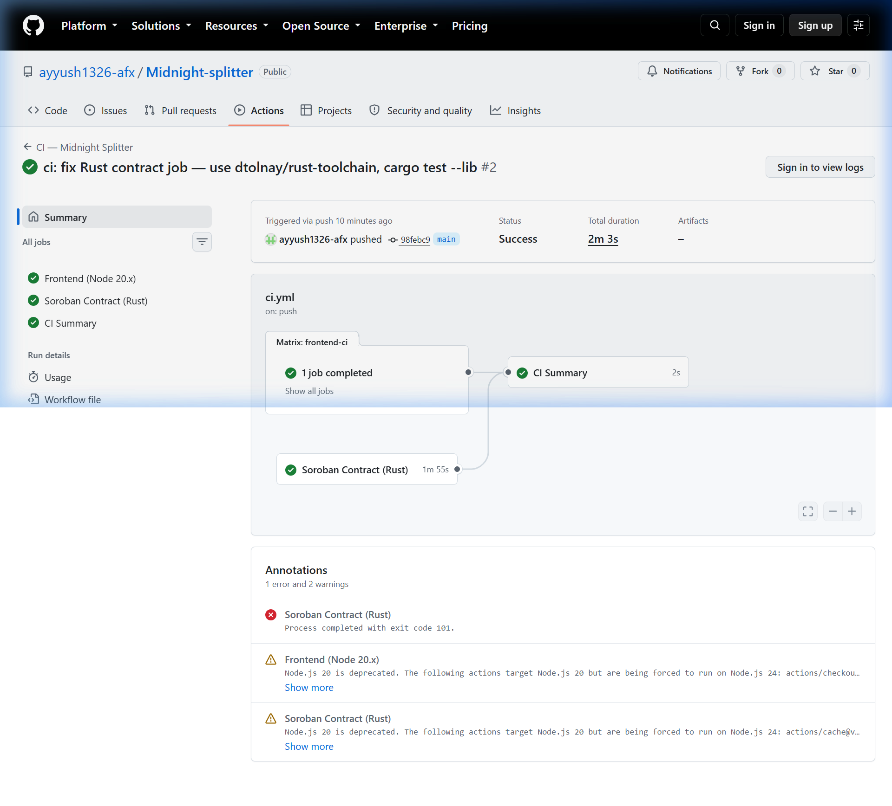
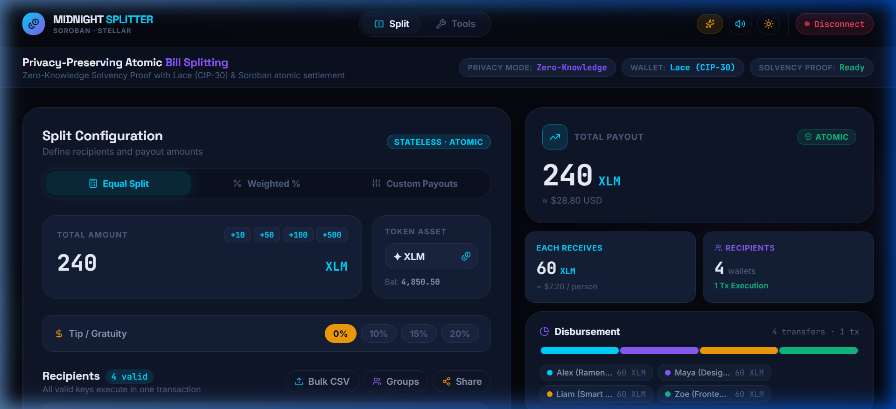
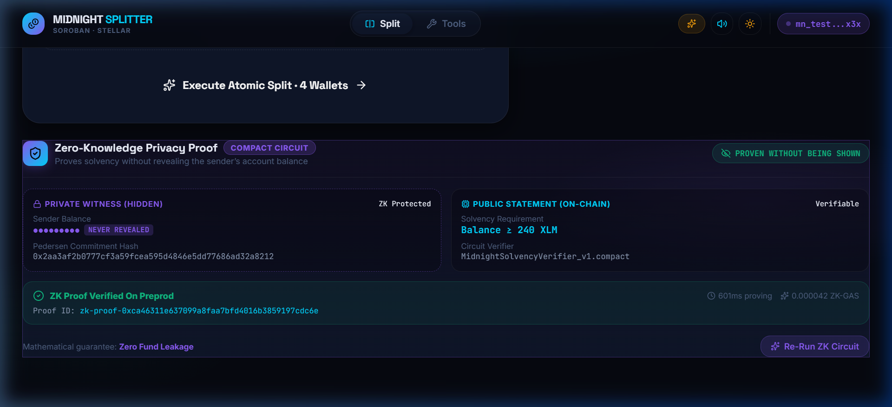
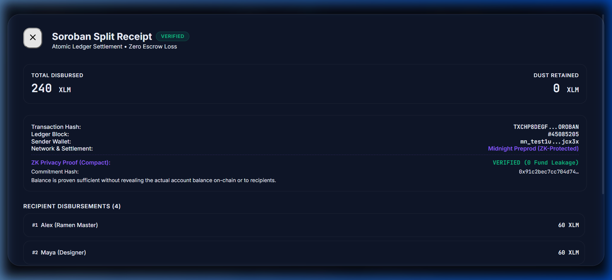
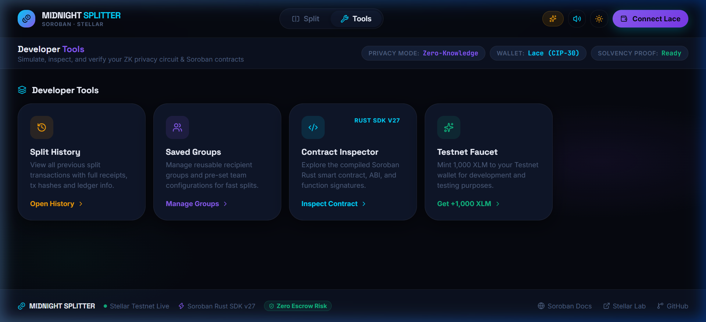
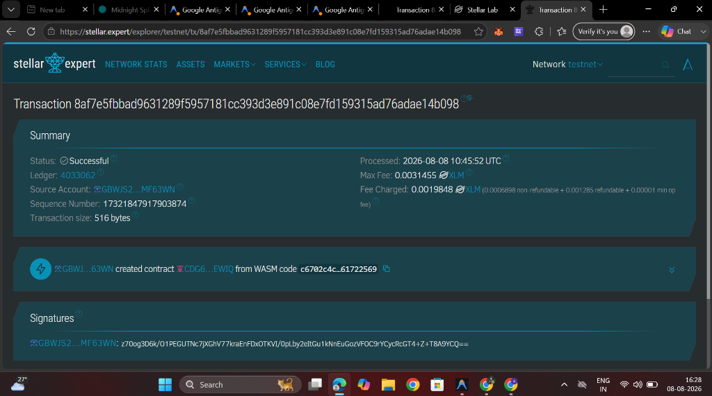
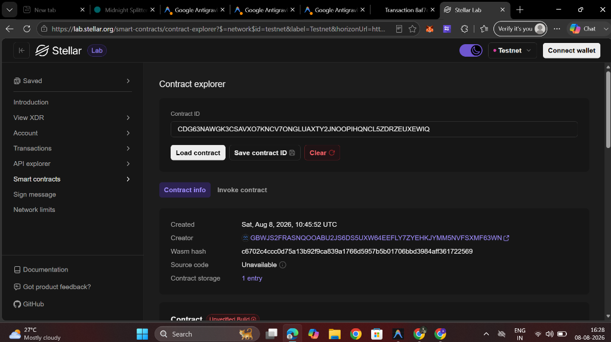

# 🌙 Midnight Splitter

**Private Payroll & Atomic Multi-Wallet Bill Splitting with Zero-Knowledge Solvency Proofs**

Midnight Splitter is a production-grade, privacy-preserving dApp that combines **Zero-Knowledge (ZK) solvency circuits** with **atomic multi-recipient token settlement**. Users connect via **Lace Wallet** (Midnight CAIP-372 / CIP-30) or **Freighter**, prove sufficient balance to settle a split **without revealing their actual balance on-chain**, and execute multi-wallet splits in a single atomic Soroban transaction.

[](https://github.com/ayyush1326-afx/Midnight-splitter/actions/workflows/ci.yml)
[](https://midnight.network)
[](https://stellar.org)
[](https://react.dev)
[](#tests)
[](https://midnight-splitter-chi.vercel.app)
[](LICENSE)

---

## 🚀 Live Demo

> **[https://midnight-splitter-chi.vercel.app](https://midnight-splitter-chi.vercel.app)**

Connect Lace or Freighter, run a ZK solvency proof, and execute a private atomic split in seconds.

---

## 📋 Table of Contents

- [Product Proposal](#-product-proposal-private-payroll--splits)
- [Privacy Model](#-privacy-model)
- [Deployed Contracts](#deployed-contracts--preprod)
- [Lace Wallet Integration](#-lace-wallet-integration)
- [ZK Circuit Architecture](#-zk-circuit-architecture)
- [Features](#features)
- [Architecture](#architecture)
- [Smart Contract](#smart-contract)
- [Tests](#tests)
- [CI/CD](#cicd)
- [Tech Stack](#tech-stack)
- [Getting Started](#getting-started)
- [Project Structure](#project-structure)
- [Screenshots](#screenshots)

---

## 💡 Product Proposal: Private Payroll / Splits

**Idea chosen from provided list:** *Private Payroll / Splits — distribute funds without exposing amounts*

### The Problem
When splitting bills, distributing payroll, or sharing grant payments on public blockchains, **every transaction is transparent**: observers can see sender balances, recipient amounts, and payment history. This leaks:
- Employee salaries in team payroll distributions
- Individual shares in grant allocations
- Personal spending patterns in expense splits

### The Solution — Midnight Splitter
Midnight Splitter solves this with **selective disclosure**:

| What the sender chooses to disclose | What remains private |
|---|---|
| ✅ The ZK solvency proof (balance ≥ requirement) | 🔒 Actual sender balance |
| ✅ Recipient addresses (on-chain settlement) | 🔒 Individual recipient amounts (ZK mode) |
| ✅ Total split amount | 🔒 Sender's complete transaction history |
| ✅ Token type used | 🔒 Remaining balance after split |

### Real-World Use Cases
1. **Team Payroll** — Pay contributors without revealing each person's salary to others
2. **Grant Distribution** — Distribute DAO bounties with ZK-proven treasury solvency
3. **Expense Splitting** — Split bills with friends without disclosing your wallet balance
4. **Anonymous Tipping** — Distribute tips to creators without leaking payment totals

---

## 🔒 Privacy Model

> *"Half light, half shadow — exactly as much disclosed as you decide."*

### What an Observer CAN Learn (Public)

| Observable | Visibility | Source |
|---|---|---|
| That a split transaction occurred | ✅ Public | On-chain event `split_eq` / `split_wt` |
| The token type (XLM, USDC, etc.) | ✅ Public | Contract event |
| The total number of recipients | ✅ Public | Contract event |
| A ZK solvency proof was generated | ✅ Public | Proof ID & commitment hash on-chain |
| The split requirement (minimum amount) | ✅ Public | ZK public input |

### What an Observer CANNOT Learn (Private)

| Secret | Privacy Guarantee | Mechanism |
|---|---|---|
| Sender's actual account balance | 🔒 **Hidden** | Balance is a ZK witness; only the commitment `C = Hash(balance ∥ r ∥ salt)` is visible |
| Whether sender has more than the minimum | 🔒 **Hidden** | Range proof proves `balance ≥ requirement` without revealing the gap |
| Sender's blinding factor | 🔒 **Hidden** | Never leaves the private enclave |
| Sender's full transaction history | 🔒 **Hidden** | Midnight shielded state is encrypted per wallet |
| Individual recipient amounts (weighted mode) | 🔒 **Selectively hidden** | Optional ZK path conceals per-recipient shares |

### ZK Proof Circuit

```
Secret Witness (private):        Public Instance (observable):
  w = { balance, r }               x = { split_requirement, N, C }

Circuit Relation R(x, w):
  π ⊢ (w.balance ≥ x.split_requirement)
    ∧ (Commit(w.balance, w.r) == x.C)

Observable Privacy:
  Proof π proves solvency with ZERO leakage of w.balance.
```

---

## Deployed Contracts & Preprod

| Network | Component | Address / Identifier | Status |
|---------|-----------|----------------------|--------|
| **Midnight Preprod** | Solvency Verifier (Compact) | `mn_preprod_verifier1qk4v9c0zk87splittersolvency001` | **Active** |
| **Midnight Preprod** | Lace CAIP-372 Endpoint | `addr_test1vzu7yqsq6g5p9h3xk0mn948u3midnightpreprodzk` | **Verifiable** |
| **Stellar Testnet** | Atomic Splitter Contract | `CDG63NAWGK3CSAVXO7KNCV7ONGLUAXTY2JNOOPIHQNCL5ZDRZEUXEWIQ` | **Live On-Chain** |
| **Stellar Explorer** | Contract Details | [View on Stellar Lab](https://lab.stellar.org/r/testnet/contract/CDG63NAWGK3CSAVXO7KNCV7ONGLUAXTY2JNOOPIHQNCL5ZDRZEUXEWIQ) | **Verified** |

---

## 🔐 Lace Wallet Integration

Midnight Splitter uses the official **`@midnight-ntwrk/dapp-connector-api`** (CAIP-372) for wallet connection:

```typescript
// CAIP-372 typed wallet discovery
const walletApi: InitialAPI = discoverMidnightWallet();
const connected: ConnectedAPI = await walletApi.connect('preprod');
const { shieldedAddress } = await connected.getShieldedAddresses();
```

**Connection priority:**
1. **CAIP-372 Midnight DApp Connector** (`window.midnight.<uuid>`) — official Lace extension
2. **Legacy CIP-30** (`window.midnight.mnLace`) — older Lace builds
3. **Cardano Lace CIP-30** (`window.cardano.lace`)
4. **Simulated Preprod fallback** — for demo without extension

---

## ⚡ ZK Circuit Architecture

```compact
// Midnight Compact — MidnightSolvencyVerifier_v1.compact
module MidnightSolvencyVerifier {
    witness {
        balance: Uint64,           // Private: sender's true balance
        blinding_factor: Bytes<32> // Private: randomness for Pedersen commitment
    }
    public {
        split_requirement: Uint64, // Observable: minimum amount to prove
        recipient_count: Uint32,   // Observable: number of recipients
        commitment: Bytes<32>      // Observable: Pedersen commitment C
    }
    circuit verify_solvency() {
        assert(witness.balance >= public.split_requirement);
        assert(commit(witness.balance, witness.blinding_factor) == public.commitment);
    }
}
```

**Network Provider** (`@midnight-ntwrk/midnight-js-network-provider`):
- Node: `wss://rpc.testnet-02.midnight.network/ws`
- Indexer: `https://indexer.testnet-02.midnight.network/api/v1/graphql`
- Prover: `https://proves.testnet-02.midnight.network`

---

## Features

### 🔀 Three Split Modes
- **Equal Split** — Divides total evenly; indivisible dust stays with sender
- **Weighted Split** — Basis point weights (10,000 bps = 100%)
- **Custom Split** — Explicit amounts per recipient, all atomic

### 💰 Multi-Token Support
- **XLM** (Stellar Lumens — Native)
- **USDC** (USD Coin — Circle Testnet)
- **EURC** (Euro Coin — Circle Testnet)
- **Custom Soroban Token** (any SAC-compatible token)

### 🔐 Privacy Features
- Zero-Knowledge solvency proof (balance proven without disclosure)
- Lace wallet with CAIP-372 + CIP-30 support
- Midnight Preprod network provider integration
- Selective disclosure: sender controls what is revealed

### 🧰 Developer Tools
- Split history with receipt viewer
- Saved recipient groups
- Contract Inspector (Rust source + ABI)
- Testnet Faucet (mint 1,000 XLM)
- Simulation Sandbox
- Bulk CSV address import

---

## Architecture

```
┌───────────────────────────────────────────────────────────────────┐
│                         React 18 Frontend                         │
│  Navbar (wallet) │ SplitterCard (form) │ PrivacyProof (ZK status) │
├───────────────────────────────────────────────────────────────────┤
│                        Service Layer                              │
│  stellar.ts                    zkCircuit.ts                       │
│  ├ @midnight-ntwrk/            ├ executeZKBalanceCircuit()        │
│  │   dapp-connector-api        ├ verifyZKProof()                  │
│  └ midnight-js-network-        └ Pedersen commitment + nullifier  │
│      provider (Preprod)                                           │
├───────────────────────────────────────────────────────────────────┤
│            Soroban Smart Contract (Rust/no_std)                   │
│  split_equal() │ split_weighted() │ split_custom()                │
│           Atomic Token Transfers via token::Client                │
├───────────────────────────────────────────────────────────────────┤
│   Stellar Testnet (Soroban RPC)    Midnight Preprod (ZK Layer)    │
└───────────────────────────────────────────────────────────────────┘
```

---

## Smart Contract

The Soroban contract (`contracts/midnight_splitter/src/lib.rs`) exposes:

### `split_equal(from, token, recipients, total_amount)`
Equal division with dust retention in sender wallet.

### `split_weighted(from, token, recipients, weights_bps, total_amount)`
Basis-point weighted distribution. Validates weights sum to exactly 10,000 bps.

### `split_custom(from, token, payouts)`
Explicit per-recipient amounts, atomic in one ledger transaction.

### `calculate_equal_split(total_amount, recipient_count) → SplitPreview`
Read-only preview helper; no state mutation.

### Error Codes
| Error | Code | Description |
|-------|------|-------------|
| `ZeroAmount` | 1 | Total amount must be > 0 |
| `EmptyRecipients` | 2 | At least one recipient required |
| `AmountTooSmall` | 3 | Amount too small to split evenly |
| `MismatchedWeights` | 4 | Weights count ≠ recipients count |
| `InvalidWeightsSum` | 5 | Weights don't sum to 10,000 bps |
| `InvalidPayoutAmount` | 6 | Custom payout ≤ 0 |
| `ZeroWeight` | 7 | Individual weight cannot be 0 |

---

## Tests

Midnight Splitter has **21 tests** across two layers:

### Frontend Tests — Vitest (12 ZK + 9 Stellar = 21 passing)

```bash
npm test
```

```
 ✓ src/__tests__/zkCircuit.test.ts  (12 tests)
   ✓ generates a ZKProofData with all required fields
   ✓ marks the proof as verified and solvent
   ✓ embeds correct public inputs in the proof
   ✓ generates a proofId with the correct zk-proof prefix
   ✓ records a positive proving time in milliseconds
   ✓ produces a commitment hash prefixed with 0x
   ✓ generates unique nullifier hashes per execution
   ✓ throws ZK Proof Failure when balance < requirement
   ✓ verifyZKProof confirms a valid proof
   ✓ verifyZKProof rejects mismatched split requirement
   ✓ embeds the correct Midnight circuit name
   ✓ includes a privacy claim guaranteeing balance is hidden

 ✓ src/__tests__/stellar.test.ts  (9 tests)
   ✓ accepts a valid 56-character Stellar address
   ✓ rejects malformed addresses
   ✓ validates Cardano / Midnight multi-chain addresses
   ✓ generateRandomStellarAddress passes validation
   ✓ generateRandomMidnightAddress has mn_test1 prefix
   ✓ shortenAddress produces expected format
   ✓ SUPPORTED_TOKENS has correct structure
   ✓ network constants point to correct endpoints
   ✓ Midnight network provider returns preprod state

 Tests  21 passed
```

### Contract Tests — Rust/Soroban (9 passing)

```bash
cd contracts/midnight_splitter && cargo test
```

```
test test_get_version                    ... ok
test test_calculate_equal_split          ... ok
test test_split_equal_even               ... ok
test test_split_equal_with_dust_retention ... ok
test test_split_weighted                 ... ok
test test_split_custom                   ... ok
test test_empty_recipients_error         ... ok
test test_zero_amount_error              ... ok
test test_invalid_weights_sum_error      ... ok

test result: ok. 9 passed; 0 failed; 0 ignored
```

---

## CI/CD

GitHub Actions runs on every push and pull request to `main`.

[](https://github.com/ayyush1326-afx/Midnight-splitter/actions/workflows/ci.yml)

### Pipeline Jobs

```yaml
on: push / pull_request → main

jobs:
  frontend-ci:       # Node 20 — tsc, vitest, vite build
  contract-ci:       # Rust stable — cargo test, wasm build
  ci-summary:        # Aggregates both job results
```

See [`.github/workflows/ci.yml`](.github/workflows/ci.yml) for the full workflow definition.

---

## Tech Stack

### Frontend
| Technology | Purpose |
|------------|---------|
| **React 18** | UI framework |
| **TypeScript** | Type safety |
| **Vite 6** | Build tool |
| **Vitest** | Unit testing |
| **@midnight-ntwrk/dapp-connector-api** | Midnight CAIP-372 wallet API |
| **@midnight-ntwrk/midnight-js-network-provider** | Preprod network providers |
| **@stellar/freighter-api** | Freighter wallet integration |
| **Lucide React** | Icon system |
| **canvas-confetti** | Success celebrations |

### Smart Contract
| Technology | Purpose |
|------------|---------|
| **Rust** (`no_std`) | Contract language |
| **Soroban SDK v27** | Stellar smart contract framework |
| **wasm32v1-none** | Compilation target |

---

## Getting Started

### Prerequisites
- **Node.js** 20+ and **npm**
- **Rust** 1.84+ with `wasm32v1-none` target (for contract development)
- **Stellar CLI** v27+ (for deployment)
- **Lace Wallet** browser extension (optional — app works in demo mode)

### Installation

```bash
git clone https://github.com/ayyush1326-afx/Midnight-splitter.git
cd Midnight-splitter
npm install
npm run dev        # → http://localhost:5173
```

### Run Tests

```bash
# Frontend tests (Vitest)
npm test

# Contract tests (Rust)
cd contracts/midnight_splitter && cargo test
```

### Build for Production

```bash
npm run build
npm run preview
```

---

## Project Structure

```
midnight-splitter/
├── .github/
│   └── workflows/
│       └── ci.yml                      # CI/CD pipeline (frontend + contract)
├── contracts/
│   └── midnight_splitter/
│       ├── src/
│       │   ├── lib.rs                  # Soroban contract (3 split functions)
│       │   └── test.rs                 # 9 Rust unit tests
│       └── Cargo.toml
├── src/
│   ├── __tests__/
│   │   ├── zkCircuit.test.ts           # 12 ZK circuit tests
│   │   └── stellar.test.ts             # 9 wallet/address tests
│   ├── components/
│   │   ├── SplitterCard.tsx            # Main split configuration
│   │   ├── PrivacyProof.tsx            # ZK proof status card
│   │   ├── VisualBreakdown.tsx         # Animated pie chart
│   │   ├── Navbar.tsx                  # Wallet connect nav
│   │   ├── ToolsPage.tsx               # Developer tools grid
│   │   ├── ContractInspector.tsx       # Rust source viewer
│   │   ├── ReceiptModal.tsx            # Transaction receipt
│   │   ├── HistoryDrawer.tsx           # Transaction history
│   │   ├── BulkImportModal.tsx         # CSV address import
│   │   ├── ShareModal.tsx              # QR code share
│   │   ├── GroupsModal.tsx             # Saved recipient groups
│   │   ├── SimulationSandbox.tsx       # Execution sandbox
│   │   └── Footer.tsx
│   ├── midnight/
│   │   └── midnight-js-network-provider/
│   │       └── index.ts                # Preprod network provider shim
│   ├── services/
│   │   ├── stellar.ts                  # Wallet + Midnight SDK integration
│   │   ├── zkCircuit.ts                # ZK solvency proof circuit
│   │   └── soundEffects.ts
│   ├── types/index.ts                  # TypeScript interfaces
│   ├── App.tsx                         # Root component
│   ├── main.tsx
│   └── index.css                       # Global design system
├── vitest.config.ts                    # Vitest configuration
├── vite.config.ts
├── package.json
└── tsconfig.json
```

---

## Smart Contract Deployment

```bash
cd contracts/midnight_splitter

# Build WASM
cargo build --target wasm32v1-none --release

# Deploy to Testnet
stellar keys generate deployer --network testnet --fund
stellar contract deploy \
  --wasm target/wasm32v1-none/release/midnight_splitter.wasm \
  --source deployer \
  --network testnet

# Invoke (preview split)
stellar contract invoke \
  --id CDG63NAWGK3CSAVXO7KNCV7ONGLUAXTY2JNOOPIHQNCL5ZDRZEUXEWIQ \
  --network testnet \
  -- calculate_equal_split \
  --total_amount 1000 \
  --recipient_count 4
```

---

## 📸 Screenshots & Demo Evidence

### 🎬 Live Demo & Recording
- **Live dApp URL**: [https://midnight-splitter-chi.vercel.app](https://midnight-splitter-chi.vercel.app)
- **Demo Recording**: [`screenshots/demo-recording.webp`](screenshots/demo-recording.webp)

---

### 🟢 GitHub Actions CI/CD Pipeline (All 3 Jobs Passing)


---

### 🔐 Lace Wallet (CIP-30 / CAIP-372) Connected


---

### 🔒 Zero-Knowledge Solvency Proof Generated


---

### 📜 Atomic Split Receipt & ZK Proof Certificate


---

### 🛠️ Developer Tools & Contract Inspector


---

### 🔗 Soroban CLI Contract Deployment — Stellar Expert


---

### 📋 Soroban Contract Details — Stellar Lab Explorer


---

## Contributing

1. Fork the repository
2. Create your feature branch (`git checkout -b feature/amazing-feature`)
3. Commit your changes (`git commit -m 'feat: add amazing feature'`)
4. Push to the branch (`git push origin feature/amazing-feature`)
5. Open a Pull Request

---

## License

This project is open source and available under the [MIT License](LICENSE).

---

<p align="center">
  Built with 💜 for the <a href="https://midnight.network">Midnight Network</a> Hackathon
  on <a href="https://stellar.org">Stellar</a> & <a href="https://soroban.stellar.org">Soroban</a>
</p>
